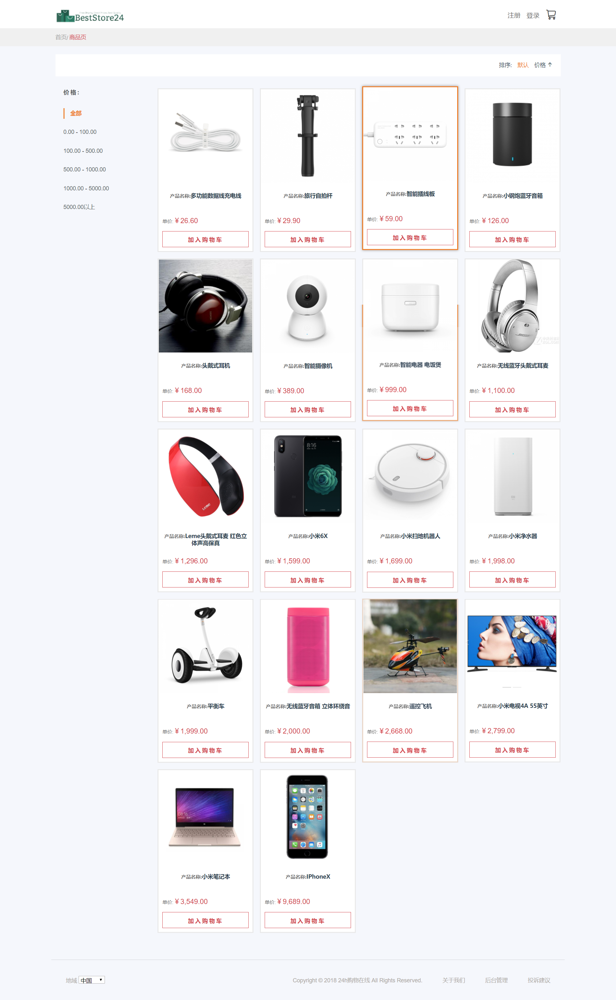
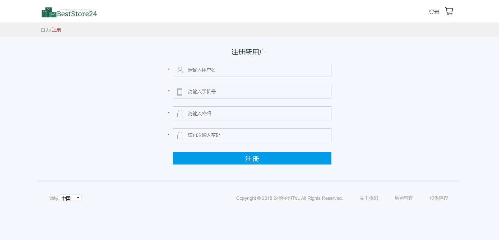
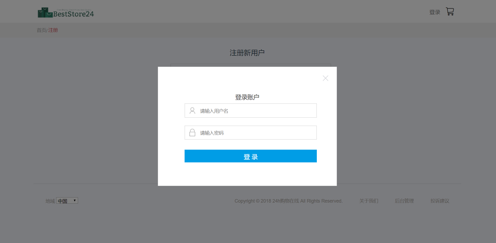
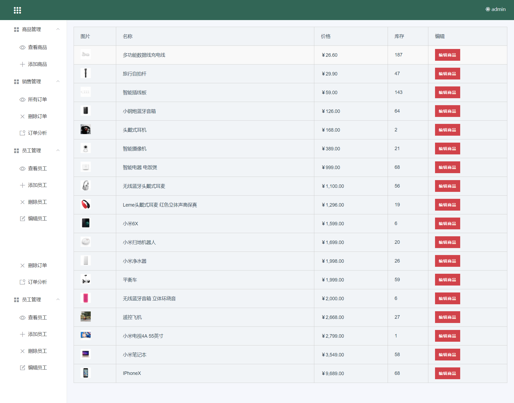
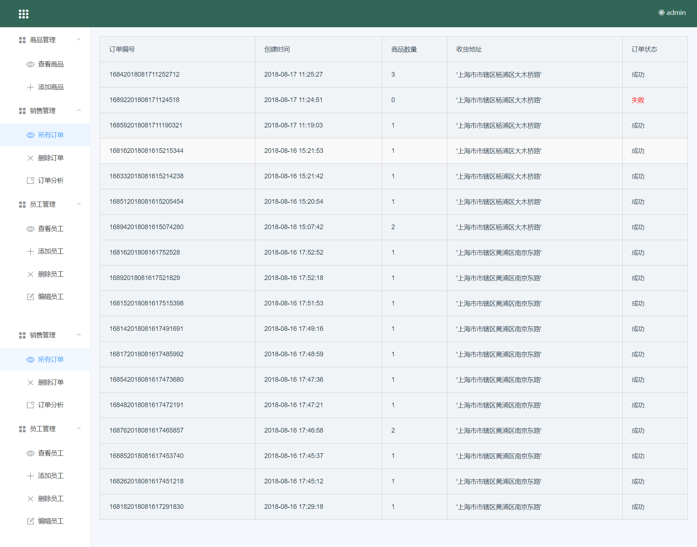
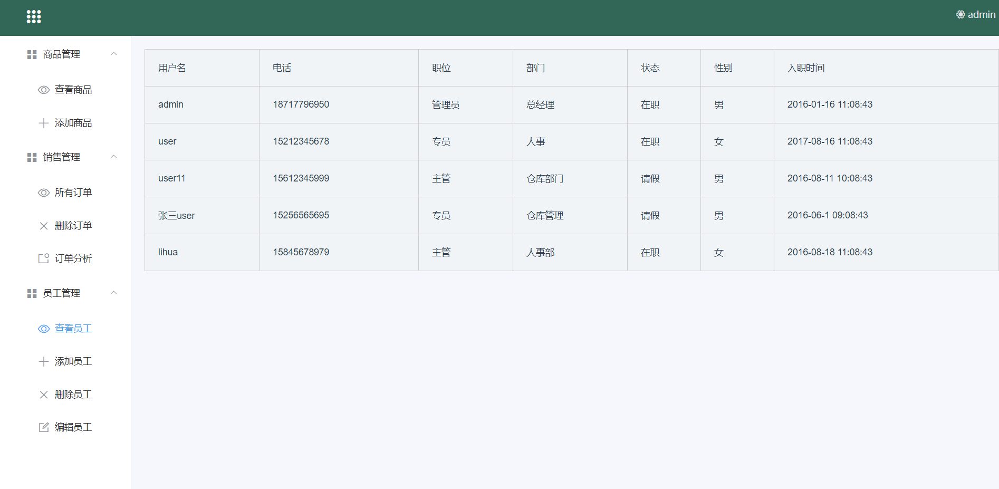

# mall商城

> 使用vue做前端界面开发，express做后台框架，使用mongodb做数据库开发的一个商城购物网站，包含用户模块，商品模块，地址模块，交易模块，具体功能有：用户的注册和登录，购买商品的添加、删除、编辑，前端商品筛选，用户地址的添加、删除，提交订单后的交易等功能实现。

## 项目的启动

1首先启动本地的mongodb数据库。在安装mongodb程序目录bin下，运行mongo
2切换到mallServer目录下，运行后台程序，执行命令
``` bash
npm start
```
3在项目的目录下，运行前端的vue启动命令
``` bash
# 首先按照各种依赖包
npm install

# 启动运行在路径localhost:8090
npm run dev

```
## 项目文件目录介绍

- data:mongodb数据库需要的文件，可以使用mongoimport导入
- preview:项目启动后的预览效果图

* 首页 
* 注册 
* 登录 
* 管理员后台 
* 所有订单 
* 员工管理 
